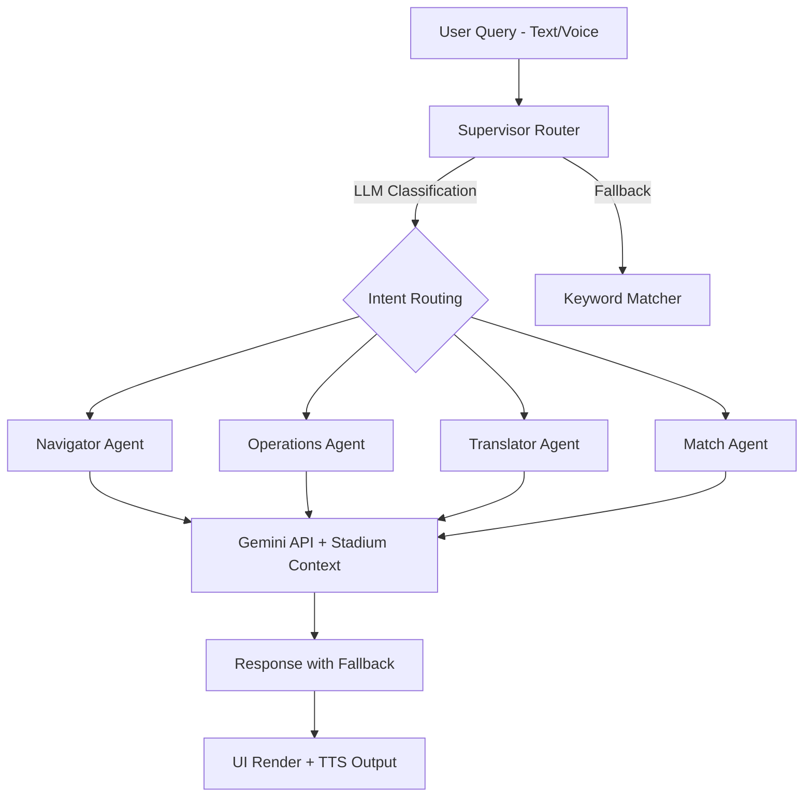

# ⚽ KickMate — AI-Powered FIFA World Cup 2026 Fan Companion

> A GenAI-enabled Progressive Web App that enhances stadium operations and the overall tournament experience for fans attending the FIFA World Cup 2026.

**Live Demo**: [Deployed on Vercel](https://kick-mate.vercel.app)

---

## 📋 Table of Contents

- [Chosen Vertical](#chosen-vertical)
- [Approach and Logic](#approach-and-logic)
- [How the Solution Works](#how-the-solution-works)
- [Architecture](#architecture)
- [Key Features](#key-features)
- [Tech Stack](#tech-stack)
- [Project Structure](#project-structure)
- [Setup & Installation](#setup--installation)
- [Testing](#testing)
- [Assumptions Made](#assumptions-made)
- [Problem Statement Alignment](#problem-statement-alignment)

---

## 🎯 Chosen Vertical

**Stadium Fan Experience & Operations Intelligence**

KickMate addresses the FIFA World Cup 2026 challenge by building a **smart, dynamic AI assistant** that serves as an all-in-one companion for fans attending matches. The solution spans **seven key domains** from the problem statement:

1. **Navigation** — AI-powered indoor stadium wayfinding
2. **Multilingual Assistance** — Real-time bi-directional translation with voice I/O
3. **Crowd Management** — Live heatmap visualization and congestion alerts
4. **Accessibility** — Screen reader support, high contrast, large text modes
5. **Transportation** — Parking zone tracking with walk-time estimates
6. **Sustainability** — Eco Hub with carbon-offset and waste reduction features
7. **Operational Intelligence** — SOS dispatch system, spill/cleanup crew routing, and admin console

---

## 🧠 Approach and Logic

### Design Philosophy

KickMate uses a **Multi-Agent Coordinator architecture** — a pattern inspired by enterprise AI orchestration systems — to handle the diverse range of fan queries with contextual intelligence rather than simple keyword matching.

### Why Multi-Agent?

A single monolithic chatbot struggles with the breadth of stadium operations. Instead, KickMate implements a **two-tier supervisor/specialist routing system**:

1. **Tier 1 — Supervisor Router**: Analyzes incoming queries using Google Gemini LLM classification (with keyword-based fallback) and dynamically routes them to the correct specialist agent.
2. **Tier 2 — Specialist Agents**: Four purpose-built agents, each with domain-specific prompts, context, and fallback logic:
   - **Navigator Agent** — Translates location queries into step-by-step directions
   - **Operations Agent** — Handles SOS alerts, medical dispatches, spill cleanups
   - **Translator Agent** — Provides translations with local city/transit jargon context
   - **Match Agent** — Delivers live commentator-style match summaries

### Logical Decision Making

The supervisor uses intent classification to make **context-aware routing decisions**:
- Queries about *seats, gates, food courts, restrooms* → Navigator Agent
- Queries about *emergencies, medical, spills, security* → Operations Agent
- Queries about *translation, language, transport jargon* → Translator Agent
- Queries about *scores, match events, statistics* → Match Agent

Each agent follows the same pattern: **Try Gemini API → parse response → fallback to pre-built response** — ensuring the app works reliably both online and offline.

---

## 🔄 How the Solution Works

### End-to-End User Flow

```
1. Fan opens KickMate on their phone browser
2. Premium landing page → Login (demo credentials) → Onboarding (select stadium, language, seat)
3. Home dashboard shows: Live match ticker, Quick Ask (text/voice), feature cards
4. Fan asks a question (e.g., "Where is the nearest restroom?")
   └─→ Query enters the Multi-Agent Coordinator
       └─→ Supervisor classifies intent → Routes to Navigator Agent
           └─→ Agent calls Gemini API with stadium-specific prompt
               └─→ Returns step-by-step directions with landmarks and floor info
5. Fan can also:
   - Use voice input → Speech-to-Text → AI processes → Text-to-Speech response
   - Open the Translator for bi-directional real-time conversation translation
   - View the 3D stadium walkthrough for visual navigation
   - Trigger SOS emergency alerts with automatic crew dispatch
   - Check parking zone availability with walk-time estimates
   - Post on the Fan Wall with AI content moderation
```

### GenAI Integration Details

| Feature | Model Used | Purpose |
|---------|-----------|---------|
| Chat & Navigation | `gemma-4-31b-it` | Stadium Q&A, routing classification |
| Translation | `gemini-3.5-flash` | Fast, accurate text translation |
| Content Moderation | `gemma-4-31b-it` | Social wall toxicity filtering |
| Camera OCR | `gemini-3.5-flash` | Extract & translate text from images |

**Security measures**: All user inputs are sanitized (control characters stripped, length-capped) before reaching the API. Rate limiting (10 req/min) and response caching (5-min TTL) prevent abuse and optimize costs.

---

## 🏗️ Architecture



### Application Architecture

```
src/
├── components/          # Reusable UI components
│   ├── ErrorBoundary.tsx   # React error boundary for crash resilience
│   └── layout/             # AppHeader, BottomNav, SOSButton, NotificationPanel
├── constants.ts         # Centralized configuration constants
├── data/                # Mock data, stadium configs, language dictionaries
├── hooks/               # Custom React hooks (useSpeech, useTheme)
├── pages/               # Lazy-loaded page components (code-splitting)
├── services/            # Core business logic
│   ├── agents/             # Multi-agent coordinator system
│   │   ├── coordinator.ts     # Supervisor router with LLM + keyword fallback
│   │   ├── specialists.ts     # 4 specialist agent implementations
│   │   └── state.ts           # Typed agent state interface
│   ├── gemini.ts           # Gemini API client with rate limiting & caching
│   ├── notificationService.ts  # Pub/sub notification system
│   ├── storage.ts          # LocalStorage persistence layer
│   └── voice.ts            # Web Speech API (STT/TTS) service
├── styles/              # CSS design system with dark/light themes
├── types/               # TypeScript type definitions
└── __tests__/           # Vitest test suites
```

---

## ✨ Key Features

### 🤖 AI-Powered Features
- **Multi-Agent Chat System** — Context-aware routing to specialist agents
- **Voice Assistant** — Speech-to-text input with text-to-speech responses
- **Bi-directional Translator** — Real-time translation with draft staging
- **Camera Translation** — Point camera at signs/menus for instant OCR + translation
- **AI Content Moderation** — Toxicity filtering on the social fan wall
- **Smart Notifications** — AI-translated alerts for concourse queues, gate changes

### 🏟️ Stadium Operations
- **3D Stadium Walkthrough** — Three.js-powered immersive venue exploration
- **Indoor Navigation** — Step-by-step directions to seats, food, restrooms, exits
- **SOS Emergency System** — One-tap alert with medical/security crew dispatch + ETAs
- **Parking Assistant** — Real-time zone availability with walk-time estimates
- **Crowd Heatmap** — Live visualization of stadium congestion points

### 🌍 Inclusivity & Accessibility
- **WCAG 2.1 Compliance** — Semantic HTML, ARIA labels, keyboard navigation
- **High Contrast Mode** — Toggle for visually impaired users
- **Large Text Mode** — Adjustable font sizing
- **Screen Reader Support** — Skip-to-content links, role attributes, live regions
- **RTL Language Support** — Arabic and other RTL language layouts

### 📱 Progressive Web App
- **Offline Support** — Service worker with precached assets
- **Installable** — Add-to-homescreen with app manifest
- **Mobile-First Design** — Optimized for smartphone screens, centered on desktop

---

## 🛠️ Tech Stack

| Layer | Technology |
|-------|-----------|
| Frontend | React 19 + TypeScript |
| Build | Vite 8 |
| AI/LLM | Google Gemini API (gemma-4-31b-it, gemini-3.5-flash) |
| 3D | Three.js |
| Voice | Web Speech API (SpeechRecognition + SpeechSynthesis) |
| PWA | vite-plugin-pwa + Workbox |
| Styling | Vanilla CSS with design tokens |
| Testing | Vitest + React Testing Library |
| Hosting | Vercel |
| Analytics | Vercel Analytics |

---

## 🚀 Setup & Installation

```bash
# Clone the repository
git clone https://github.com/amarjeetsahoo/KickMate.git
cd KickMate

# Install dependencies
npm install

# Set up environment variables
cp .env.example .env
# Add your Google Gemini API key to VITE_GEMINI_API_KEY

# Start development server
npm run dev

# Run tests
npm run test

# Build for production
npm run build
```

### Demo Credentials
- **Email**: `demo@kickmate.com`
- **Password**: `kickmate2026`

> The app works without an API key using intelligent offline fallbacks.

---

## 🧪 Testing

```bash
# Run all tests
npm run test

# Run with coverage
npm run test -- --coverage
```

### Test Coverage

| Test Suite | What it covers |
|-----------|---------------|
| `agents.test.ts` | Multi-agent routing, specialist fallbacks, immutability |
| `components.test.tsx` | BottomNav, AppHeader, SOSButton rendering & interactions |
| `storage.test.ts` | LocalStorage persistence, profile loading, defaults |
| `stadiums.test.ts` | Stadium data integrity, zone definitions |
| `languages.test.ts` | Language dictionary completeness |
| `mockData.test.ts` | Mock match data validation |
| `3d.test.tsx` | Three.js component rendering |

---

## 📌 Assumptions Made

1. **Demo Environment**: The app is designed for demonstration purposes for the FIFA World Cup 2026 challenge. Live match data, crowd heatmaps, and parking availability are simulated using realistic mock data.

2. **Google Gemini API**: The solution assumes access to Google's Gemini API (free tier via AI Studio). When no API key is configured, the app degrades gracefully to offline fallback responses — ensuring full functionality without any external dependency.

3. **Stadium Data**: Three confirmed FIFA 2026 venues are modeled (SoFi Stadium, AT&T Stadium, MetLife Stadium). Stadium zones, gate configurations, and navigation paths are based on publicly available venue information.

4. **Browser APIs**: Voice features rely on the Web Speech API, which is supported in modern browsers (Chrome, Edge, Safari). The app provides clear feedback when a browser doesn't support these features.

5. **Mobile-First Design**: The app is designed primarily for fans using smartphones at the stadium. Desktop access is supported with a centered mobile frame layout.

6. **Single User Session**: Authentication uses localStorage for demo simplicity. A production deployment would integrate with OAuth or SSO providers.

7. **Content Moderation**: The AI moderation on the social wall uses Gemini for toxicity detection. In production, this would be supplemented with a dedicated content safety API.

---

## ✅ Problem Statement Alignment

The table below maps each requirement from the problem statement to the specific KickMate feature that addresses it:

| Problem Statement Requirement | KickMate Feature | Implementation |
|------------------------------|------------------|----------------|
| **Navigation** | Stadium Navigator + 3D Walkthrough | AI-powered directions to seats, food, restrooms, exits, parking via Navigator Agent |
| **Crowd Management** | Crowd Heatmap Visualization | Real-time simulated congestion overlays on stadium maps |
| **Accessibility** | High Contrast, Large Text, Screen Reader | WCAG 2.1 compliance, ARIA labels, skip links, keyboard navigation |
| **Transportation** | Parking Assistant | Live zone availability, walk-time estimates, proximity to gates |
| **Sustainability** | Eco Hub | Carbon tracking, waste reduction tips, eco-friendly venue info |
| **Multilingual Assistance** | Bi-directional Translator | Real-time Gemini-powered translation with voice I/O and camera OCR |
| **Operational Intelligence** | SOS System + Admin Console | Emergency dispatch with ETAs, crew assignment, spill reporting |
| **Real-time Decision Support** | Multi-Agent Coordinator | AI supervisor routes queries to specialist agents for contextual responses |
| **Generative AI** | Gemini Integration | gemma-4-31b-it for chat/routing, gemini-3.5-flash for translation/OCR |

---

## 👨‍💻 Developer

**Amarjeet Sahoo**
- Portfolio: [amarjeetsahoo.qzz.io](https://amarjeetsahoo.qzz.io/)
- GitHub: [github.com/amarjeetsahoo](https://github.com/amarjeetsahoo)

---

## 📄 License

MIT License — see [LICENSE](LICENSE) for details.
